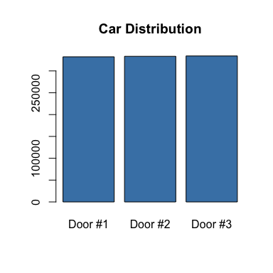
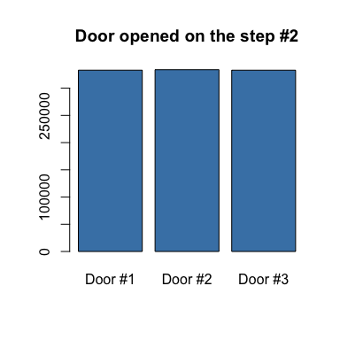
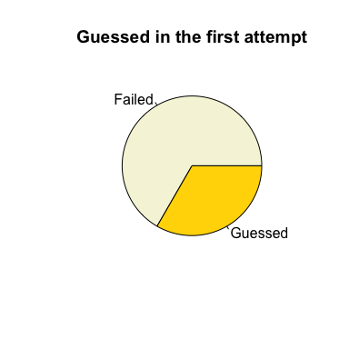
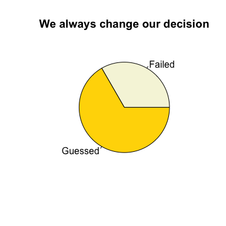
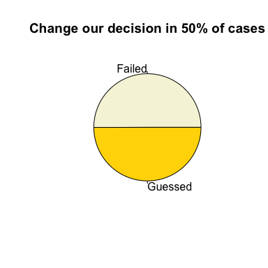

Monty Hall problem
------------------

There is a brain teaser that I couldn't to understand intuitively. So here is a demo that shows how it works practically. More details <https://en.wikipedia.org/wiki/Monty_Hall_problem>

What's given: 1. There are 3 doors, there is the car behind one of them. 2. You choose one door. 3. Then one empty door is opened. 4. You're asked to choose the door again or stay if previous one.

------------------------------------------------------------------------

### I choose three ways to go ahead:

1.  Stay with the first choice.
2.  Change your opinion every time.
3.  Change your opinion in 50% of cases.

Let's go ahead and measure which one is most effective to win prize.

------------------------------------------------------------------------

### Uniform distribution

Let's take 3 random variables from 1 to 3 uniformly distributed and ensure that they have same occurrence.

``` r
n <- 1e6 # one million attemps
numbers <- sample(3, n, replace = TRUE)
counts <- table(numbers)

barplot(counts, main='Car Distribution',
        col='steelblue',
        names.arg=c('Door #1', 'Door #2', 'Door #3'))
```



It's okay for us to go through with `sample` function.

------------------------------------------------------------------------

### Step \#1. Assign a car behind a door and make a first choice.

``` r
n = 1e6 # 1 million attempts
car <- sample(3, n, replace = T)
choiceOne <- sample(3, n, replace = T)
df <- data.frame(car, choiceOne)
head(df)
```

    ##   car choiceOne
    ## 1   1         1
    ## 2   2         1
    ## 3   2         2
    ## 4   3         2
    ## 5   2         2
    ## 6   2         3

------------------------------------------------------------------------

### Step \#2. Before second choice the one door must be opened.

-   If we guessed from the first attempt then any door of rest two will be opened.
-   If we didn't guess from the first attempt then empty door will be opened. Here they don't have a choice, they should open door that is without car and not chosen by player.

``` r
df$guessed <- ifelse(df$car == df$choiceOne, TRUE, FALSE)
df$doorOpened <- ifelse(df$guessed,  apply(df, 1, function(a) c(1:3)[c(1:3) != a['car']][sample(2, 1)]), 6 - df$car - df$choiceOne)
head(df, 10)
```

    ##    car choiceOne guessed doorOpened
    ## 1    1         1    TRUE          2
    ## 2    2         1   FALSE          3
    ## 3    2         2    TRUE          1
    ## 4    3         2   FALSE          1
    ## 5    2         2    TRUE          1
    ## 6    2         3   FALSE          1
    ## 7    1         2   FALSE          3
    ## 8    1         2   FALSE          3
    ## 9    1         1    TRUE          2
    ## 10   2         3   FALSE          1

``` r
barplot(table(df$doorOpened),
        main = 'Door opened on the step #2',
        col='steelblue',
        names.arg=c('Door #1', 'Door #2', 'Door #3'))
```



------------------------------------------------------------------------

### Step \#3. Scenario \#1. Stay with the first choice.

It's obvious that we should win in 33% of cases.

``` r
guessedWithScenario1 <- table(df$guessed)
guessedWithScenario1
```

    ##
    ##  FALSE   TRUE
    ## 666730 333270

We wins in **33.33%** of cases.

``` r
pie(guessedWithScenario1,
    main = 'Guessed in the first attempt',
    labels = c('Failed', 'Guessed'),
    col = c('beige', 'gold'))
```



------------------------------------------------------------------------

### Step \#3. Scenario \#2. Change opinion every time.

Now we exclude openedDoor and forget about first choice.

``` r
df$choiceTwo <- 6 - df$choiceOne - df$doorOpened
guessedWithScenario2 <- table(df$choiceTwo == df$car)
guessedWithScenario2
```

    ##
    ##  FALSE   TRUE
    ## 333270 666730

**Wow! It really works!** We wins in **66.67%** of cases.

``` r
pie(guessedWithScenario2,
    main = 'We always change our decision',
    labels = c('Failed', 'Guessed'),
    col = c('beige', 'gold'))
```



------------------------------------------------------------------------

### Step \#3. Scenario \#3. Change our opinion in 50% of time.

``` r
# exclude openedDoor and choose again between left two with 50% probability
df$choiceThree <- sapply(df$doorOpened, function(a) c(1:3)[c(1:3) != a][sample(2, 1)])

guessedWithScenario3 <- table(df$choiceThree == df$car)
guessedWithScenario3
```

    ##
    ##  FALSE   TRUE
    ## 500427 499573

We wins in **49.96%** of cases.

``` r
pie(guessedWithScenario3,
    main = 'Change our decision in 50% of cases',
    labels = c('Failed', 'Guessed'),
    col = c('beige', 'gold'))
```



------------------------------------------------------------------------

To summarize
------------

Finally I've got visual representation of very philosophical idea when to be more successful among uncertainty we don't need to stay with the first pick.

| Scenario                             | Probability to win |
|--------------------------------------|--------------------|
| Stay with the first choice.          | 33%                |
| **Change your opinion every time.**  | **66%**            |
| Change your opinion in 50% of cases. | 50%                |

Thank you for attention!

Vladimir Kuznetsov

Source code: <https://github.com/vladimir-kazan/monty-hall-simulation>
